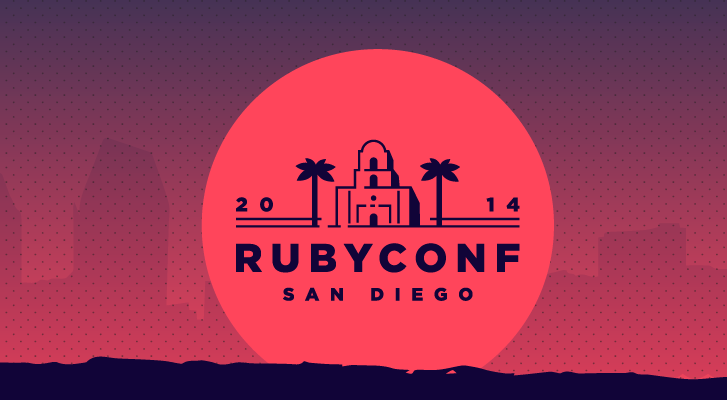
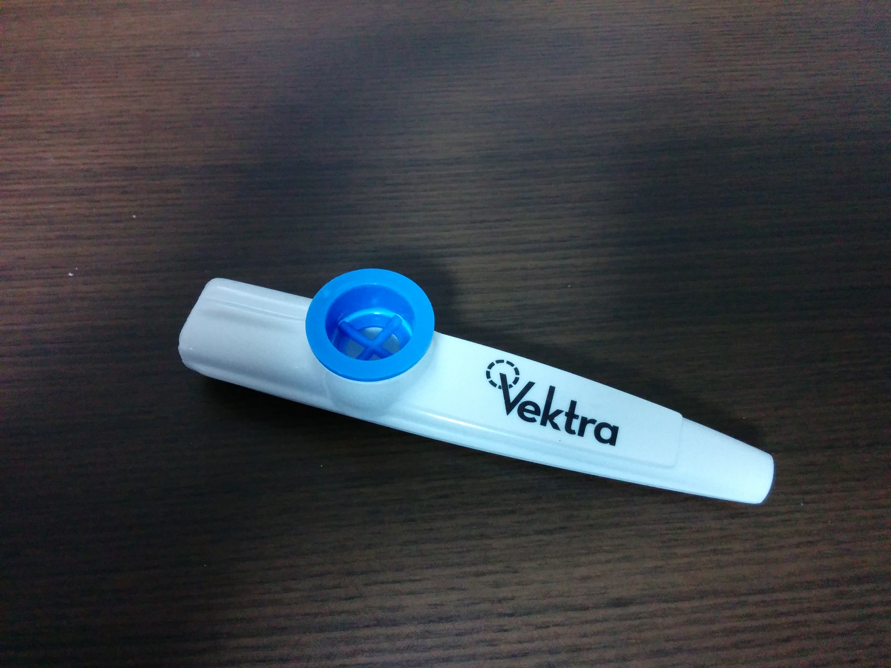
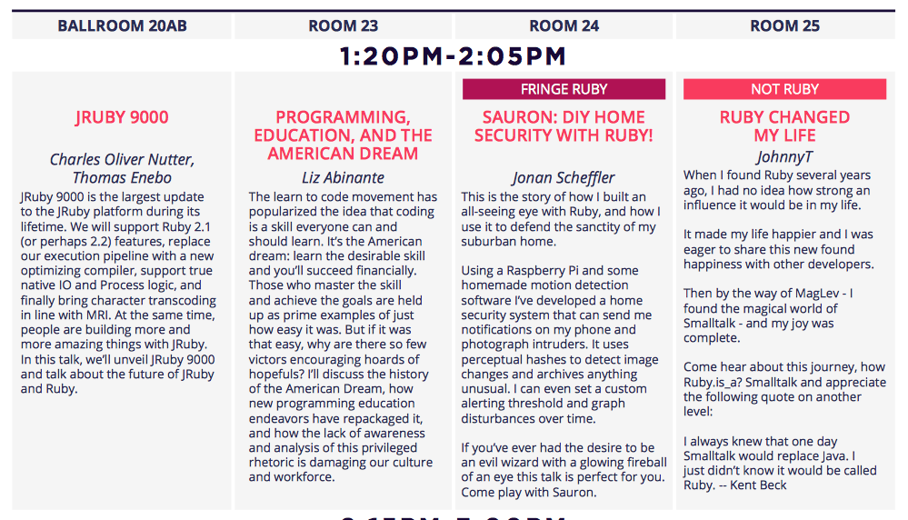
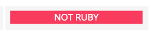
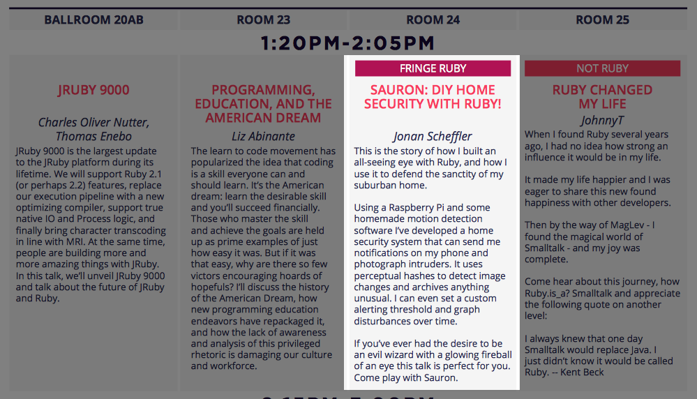
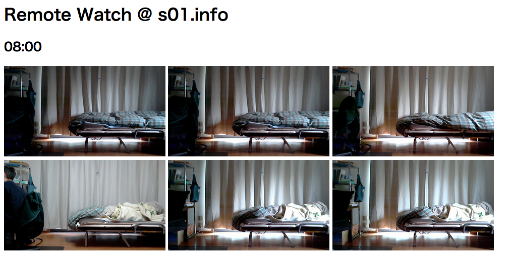
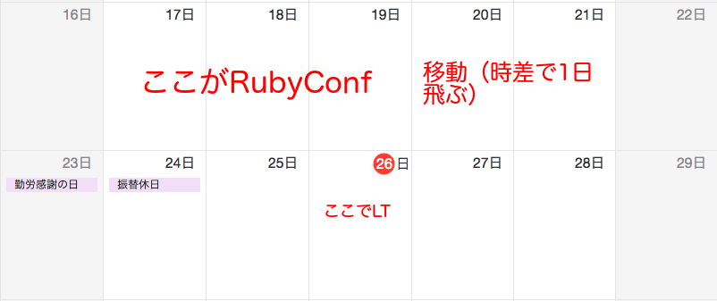
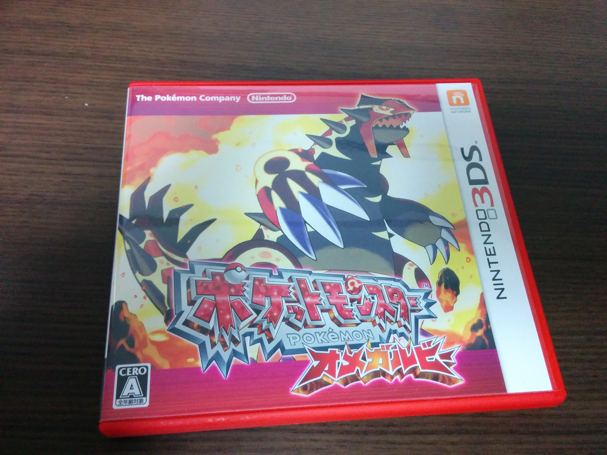
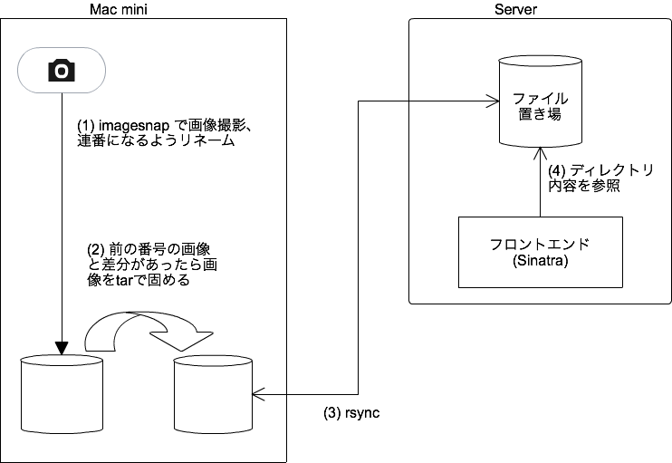
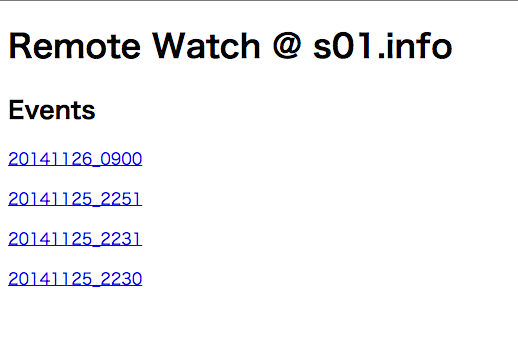

# RubyConfの話と部屋の遠隔監視ツールを改良した話

sylph01 / Ryo Kajiwara

Twitter : @s01

http://s01.ninja/

11/26/2014

---

# 自己紹介

- オーケストラでファゴット吹いてます
    - ミューザ川崎は3度ほど本番で使用
- 技術的にはただの人
    - サーバーサイドエンジニアやってます
    - RubyKaigiの通訳サポートやってました

---

^ というわけで先週サンディエゴのRubyConfに行ってきました。

---

^ Kazooの吹き方を学びました。

---

#[fit] \(boom\)

^ 嘘です。そういうLTもありましたが。

---

---

#[fit] （全選手紹介）

(画像は割愛)

^ で、全セッションの紹介しようかと最初は思ってたんですが

---

#[fit] （全選手紹介）

…してもいいんだけど時間足りない。

^ 明らかに時間が足りません。

---

---

^ なので今回は個人的に気になったセッションを紹介したいと思います。

---

^ Not Ruby…Rubyのカンファレンスとは…

---

^ …ではなくタイトルにあった通りこれです。

---

# Sauron: DIY Home Security With Ruby!
## Jonan Scheffler (@1337807)

---

# 概要

- Raspberry Piでホームセキュリティ
    - 画像を定期的にAmazon S3にアップ
    - 画像のPerceptual Hashを比較し変化を通知
- GitHub: `1337807/all_seeing_pi`, `1337087/palantir`

---

# Perceptual Hashとは

- 画像のハッシュ値計算の一種
- 見た目に同じような画像が同じようなハッシュを返す
- 8x8にリサイズ、グレースケール化し、平均値フィルタを施す or 離散コサイン変換の低周波成分から算出

---

# なんでこれ？

実は時を同じくしてそんな感じのものを作ろうとしていた。

---

---

# これは何

- 出発2日前に急いで作ったので
    - メディアサーバー兼用Mac Miniが
    - 画像をひたすら10分間隔で撮影
    - 時間の名前でファイル保存
    - サーバーにひたすらrsync

---

#[fit] やっぱり
#[fit] イベント通知
#[fit] ほしい

---

^ で、帰国後のスケジュールがこんな感じでした。4日もあれば何か作れると思うじゃないですか？それが

---

^ 21日はポケットモンスターオメガルビーの発売日でして、

---

^ あと一部の方はご存知の通り艦隊これくしょんでは秋のイベントで渾作戦が発動されており、

---

#[fit] 時間ないので
#[fit] やっつけで
#[fit] 作ってみた

^ 両方やってる私としては時間がありませんでした。なのでやっつけ…もとい最速で最小限欲しい機能を実現できるようにしようということで作ってみました。

---

#[fit] 説明:

---

---

# cronで走るスクリプト(44行)

- imagesnap を実行
- アクセスカウンタで連番を取得
- Phashion gemで前の番号とのp-hashの差分比較
    - 画像が「違う」場合はtarで固める
- tar置き場をひたすらサーバーとrsync

以上を昼間3分間隔で実行。

---

# サーバーサイド(9行+14行)

- ディレクトリの中身をリンクに変換するだけ

---

#[fit] 結果:

---

---

#[fit] イベント時にのみ
#[fit] ファイルが更新

---

#[fit] ソースとかは
#[fit] GitHubに
#[fit] あとで置きます

---

---

# ありがとうございました

- 御礼
    - Jonanさん素晴らしいネタありがとうございました
    - セッションがConfreaksに上がったらぜひ見てみてください。プレゼンの進行がめちゃめちゃ面白いです
- RubyConfは"楽しい"話が多かったです

---

#[fit] スライドはこちら
#[fit] http://s01.ninja/1126_kawasaki.pdf
#[fit] GH: sylph01/1126_kawasaki(予定)